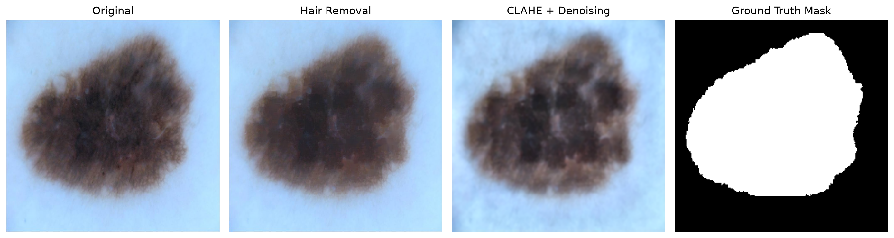
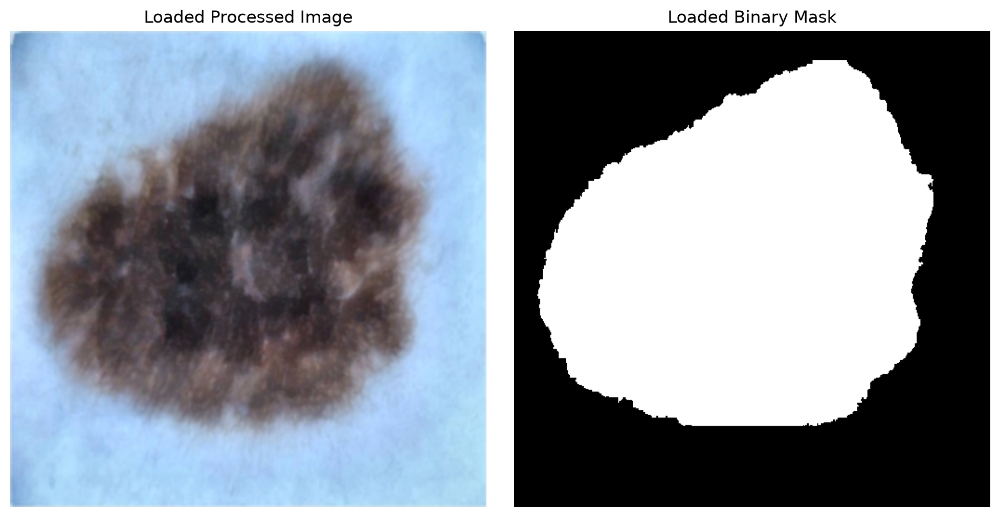
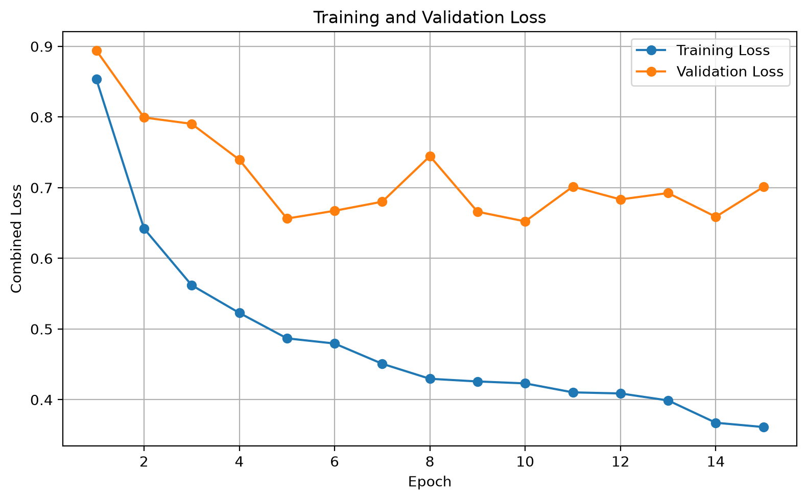
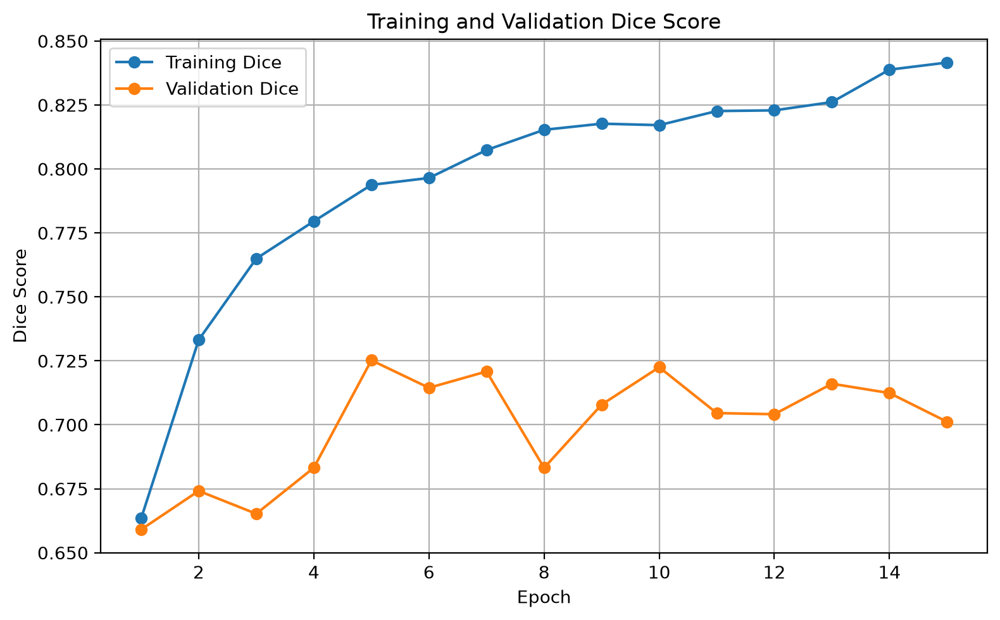
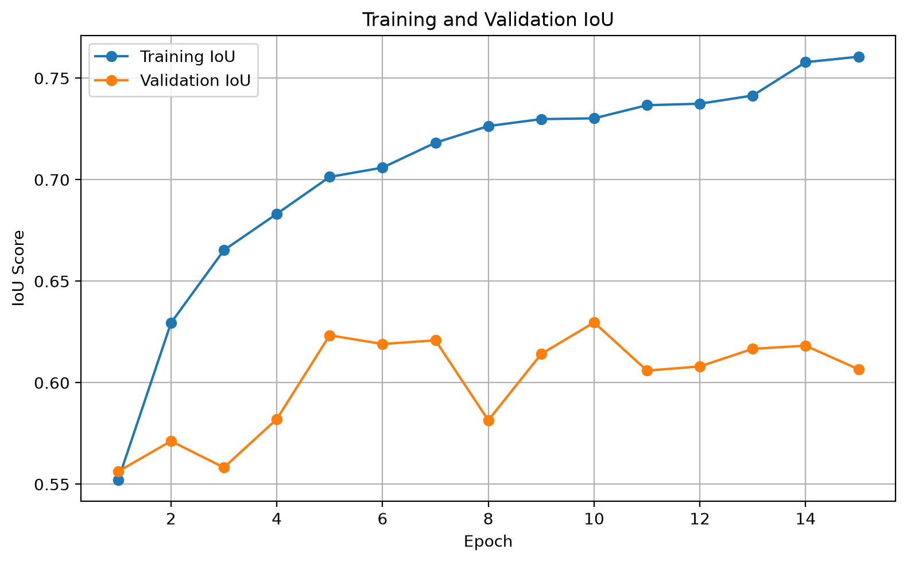
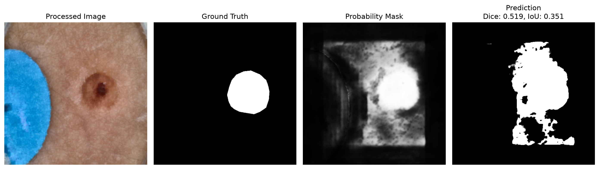
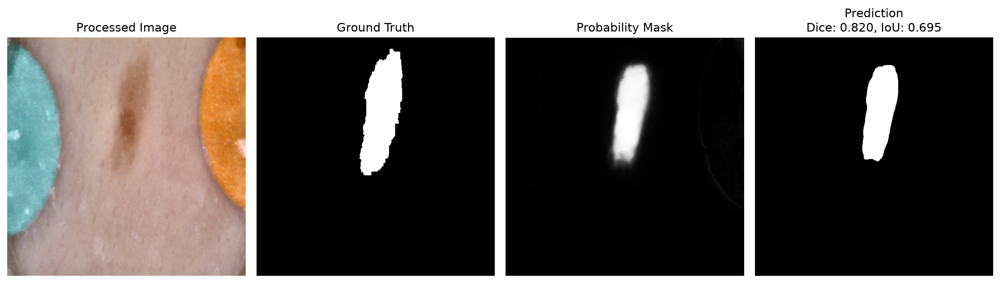

# Skin Lesion Boundary Segmentation using U-Net

## Project Overview

This project implements a deep learning pipeline for automatic skin lesion boundary segmentation using dermoscopy images from the ISIC 2018 Challenge dataset. The objective is to accurately identify lesion boundaries by generating binary segmentation masks using a baseline U-Net architecture. The project includes dataset verification, image preprocessing, model training, evaluation, and visualization of segmentation results.

---

# Project Objective

The goal of this project is to develop a baseline deep learning model capable of segmenting skin lesions from dermoscopic images.

**Input**
- Dermoscopy image

**Output**
- Binary lesion segmentation mask

The generated segmentation masks can assist in computer-aided skin lesion analysis by accurately identifying lesion boundaries.

---

# Dataset

**Dataset:** ISIC 2018 Challenge – Task 1: Lesion Boundary Segmentation

Dataset Statistics

- Total dermoscopy images: **2,594**
- Total ground truth masks: **2,594**
- Missing images: **0**
- Missing masks: **0**

Each dermoscopy image has one corresponding expert-annotated binary segmentation mask.

---

# Project Structure

```
skin-lesion-segmentation/
│
├── models/
│   ├── __init__.py
│   └── unet.py
│
├── outputs/
│   ├── preprocessing/
│   ├── plots/
│   └── predictions/
│
├── src/
│   ├── check_dataset.py
│   ├── dataset.py
│   ├── evaluate.py
│   ├── preprocess.py
│   └── train.py
│
├── .gitignore
├── AI_Log.md
├── README.md
└── requirements.txt
```

---

# Image Preprocessing

The preprocessing pipeline improves image quality before training and prepares the dataset for semantic segmentation.

The preprocessing steps include:

- Resize all images to **512 × 512**
- Hair removal using morphological black-hat operation and image inpainting
- CLAHE (Contrast Limited Adaptive Histogram Equalization)
- Gaussian denoising
- Binary mask conversion
- Save processed images and masks

## Preprocessing Pipeline

<p align="center">

</p>

---

# Dataset Verification

The dataset verification script confirms correct image-mask pairing before training.

Verified dataset:

- Images: **2,594**
- Masks: **2,594**
- Valid image-mask pairs: **2,594**

## Dataset Loader Verification

The custom PyTorch Dataset correctly loads processed images and binary masks and converts them into tensors for training.

<p align="center">

</p>

---

# Model Architecture

The baseline model is a standard **U-Net** implemented using PyTorch.

Architecture includes:

- Double convolution blocks
- Four encoder levels
- Bottleneck
- Four decoder levels
- Skip connections
- Final 1×1 convolution layer for binary segmentation

The model is trained using **BCEWithLogitsLoss + Dice Loss**, where the sigmoid activation is applied internally during loss computation.

---

# Training Configuration

| Parameter | Value |
|-----------|-------|
| Image Size | 512 × 512 |
| Batch Size | 2 |
| Epochs | 5 |
| Optimizer | Adam |
| Learning Rate | 0.0001 |
| Loss Function | BCEWithLogitsLoss + Dice Loss |
| Evaluation Metrics | Dice Score, IoU Score |
| Device | Apple MPS (Apple Silicon GPU) |

Dataset Split

- Training Images: **2,075**
- Validation Images: **519**

---

# Preliminary Results

The baseline U-Net was trained for **5 epochs**.

## Best Results

| Metric | Value |
|---------|-------|
| Best Epoch | 5 |
| Validation Loss | **0.6564** |
| Validation Dice | **0.7252** |
| Validation IoU | **0.6233** |

The model successfully learned meaningful lesion boundaries while maintaining stable validation performance throughout training.

---

# Training Curves

## Loss Curve

<p align="center">

</p>

## Dice Score

<p align="center">

</p>

## IoU Score

<p align="center">

</p>

---

# Sample Predictions

The following examples compare the original dermoscopy image, ground truth mask, and predicted lesion segmentation produced by the trained U-Net model.

## Validation Prediction 1

<p align="center">

</p>

## Validation Prediction 2

<p align="center">

</p>

---

# How to Run

### Verify the dataset

```bash
python3 src/check_dataset.py
```

### Preprocess the dataset

```bash
python3 src/preprocess.py
```

### Test the dataset loader

```bash
python3 src/dataset.py
```

### Test the U-Net model

```bash
python3 models/unet.py
```

### Train the model

```bash
python3 src/train.py
```

---

# Future Work

Potential improvements for future work include:

- Train for additional epochs
- Apply advanced data augmentation techniques
- Implement Attention U-Net
- Hyperparameter tuning
- Improve lesion boundary refinement
- Evaluate additional segmentation metrics
- Compare multiple segmentation architectures
